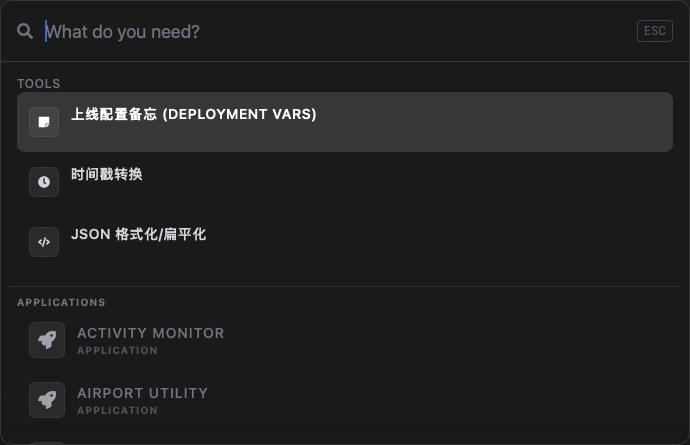
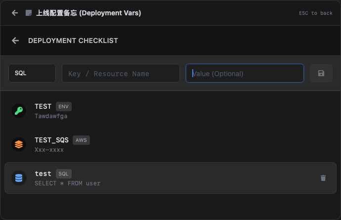
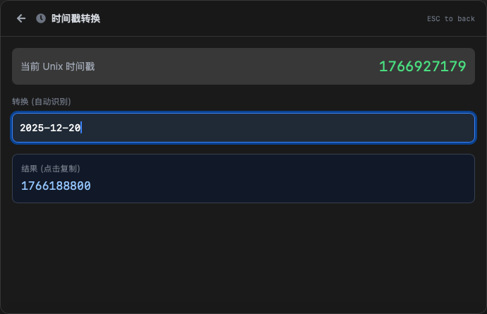
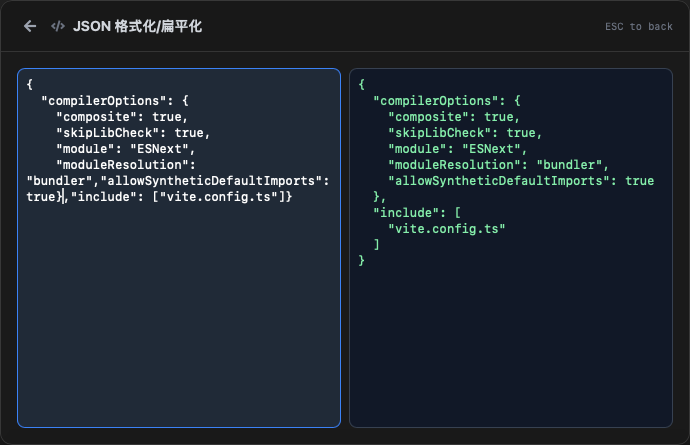

# Bei Launcher

一个轻量级的跨平台桌面启动器，集成了常用开发工具，帮助提升日常工作效率。

## 界面预览

1. 主界面
   

2. 上线配置备忘

3. 时间戳转换

4. JSON格式化


## 特性

### 应用快速启动
- 快速搜索并启动系统应用
- 支持模糊搜索，快速定位目标应用
- `Alt+Space` 全局快捷键唤起/隐藏窗口

### 内置工具集

#### 上线配置备忘 (Deployment Vars)
- 记录和管理环境配置信息
- 支持多环境配置管理（AWS、SQS 等）
- 快速查找和复制配置信息

#### 时间戳转换
- Unix 时间戳与日期时间互转
- 支持多种时间格式
- 实时转换预览

#### JSON 工具
- JSON 格式化/美化
- JSON 扁平化处理
- 语法高亮显示

## 技术栈

- **前端框架**: React 19 + TypeScript
- **桌面框架**: Tauri 2.x
- **构建工具**: Vite 7
- **样式**: Tailwind CSS
- **命令面板**: cmdk
- **图标**: React Icons

## 开发环境要求

- Node.js 18+
- Rust 1.70+
- 对于 macOS: Xcode Command Line Tools

## 快速开始

### 安装依赖

```bash
npm install
```

### 开发模式

```bash
npm run tauri dev
```

### 构建应用

```bash
npm run tauri build
```

## 使用说明

### 快捷键

- `Alt+Space` - 唤起/隐藏启动器窗口
- `ESC` - 关闭窗口或返回主界面
- `↑` / `↓` - 上下选择
- `Enter` - 确认选择

### 工具使用

1. 按 `Alt+Space` 唤起启动器
2. 输入关键词搜索工具或应用
3. 选择目标工具进入详细界面
4. 按 `ESC` 返回主界面

## 项目结构

```
bei-launcher/
├── src/                    # 前端源码
│   ├── components/         # React 组件
│   │   ├── JsonTool.tsx   # JSON 工具
│   │   └── TimestampTool.tsx # 时间戳工具
│   ├── plugins/           # 插件系统
│   │   ├── EnvRecorder.tsx # 环境配置记录
│   │   ├── interface.ts   # 插件接口定义
│   │   └── registry.tsx   # 插件注册
│   ├── App.tsx            # 主应用组件
│   └── main.tsx           # 应用入口
├── src-tauri/             # Tauri 后端（Rust）
├── public/                # 静态资源
└── package.json           # 项目配置
```

## 版本信息

当前版本: **v0.1.0** (MVP)

## 开发计划

- [ ] 支持更多系统平台 (Windows, Linux)
- [ ] 添加更多实用工具插件
- [ ] 支持自定义主题
- [ ] 插件热加载
- [ ] 用户配置同步

## IDE 推荐配置

- [VS Code](https://code.visualstudio.com/)
- [Tauri Extension](https://marketplace.visualstudio.com/items?itemName=tauri-apps.tauri-vscode)
- [rust-analyzer](https://marketplace.visualstudio.com/items?itemName=rust-lang.rust-analyzer)

## 许可证

私有项目

## 贡献

欢迎提交 Issue 和 Pull Request！
